

# Reload Realistics

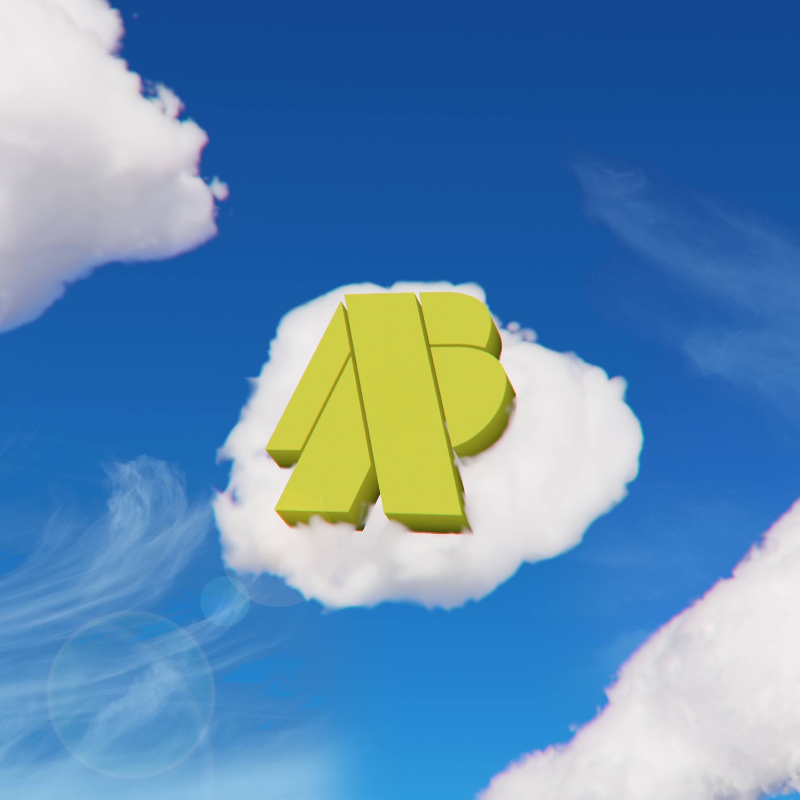

> [!IMPORTANT]
> This is the last snapshot of Reload Realistics before it was taken offline (around late 2025). There are aspects of this code that would not work anymore due to new UEFN/Verse versions. There are also many aspects of this code that could be improved or done differently.

This repo contains the Verse source code for Reload Realistics. It was a game published in Fortnite's UGC ecosystem in mid 2025 using Unreal Editor for Fortnite (UEFN). The game was inspired by the release of Fortnite Reload a year prior, with the goal of being slightly *faster* and more arcade-y.

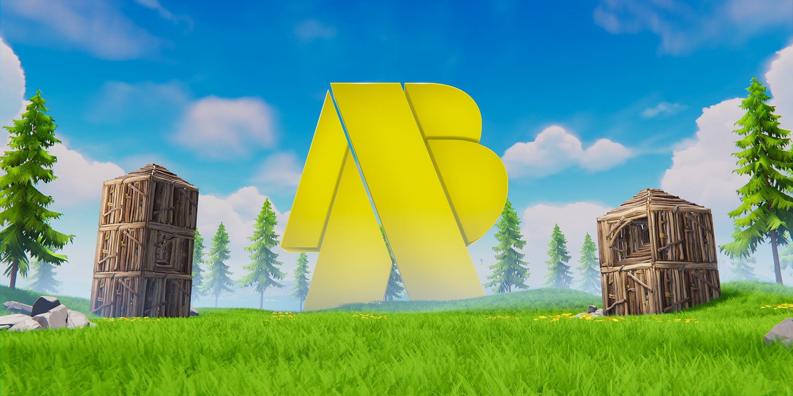

## [Gameplay Video](https://drive.google.com/file/d/1sA9eJmMIDfVD0K1vPLSju1Y-F2VxwNab/view?usp=sharing)

[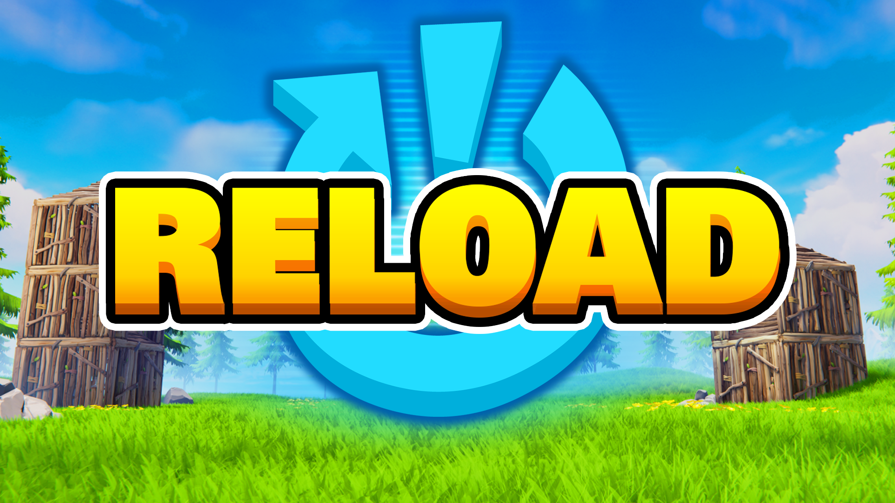](https://drive.google.com/file/d/1sA9eJmMIDfVD0K1vPLSju1Y-F2VxwNab/view?usp=sharing)

> [!IMPORTANT]
> This image is a video of gameplay. Clicking on the image or [here](https://drive.google.com/file/d/1sA9eJmMIDfVD0K1vPLSju1Y-F2VxwNab/view?usp=sharing) will bring you to a Google Drive video.

## Gallery

<table>
<tr>
    <td>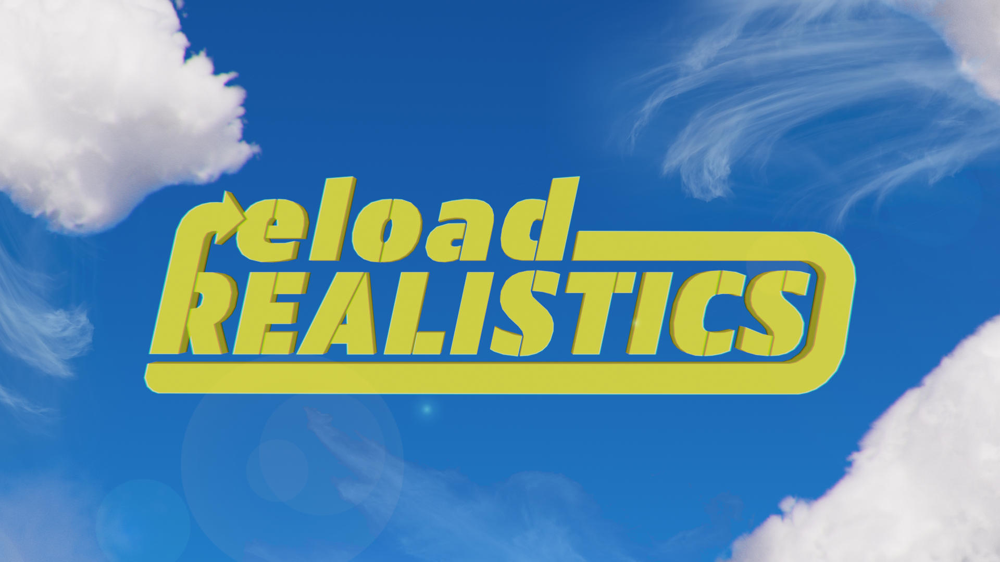</td>
    <td>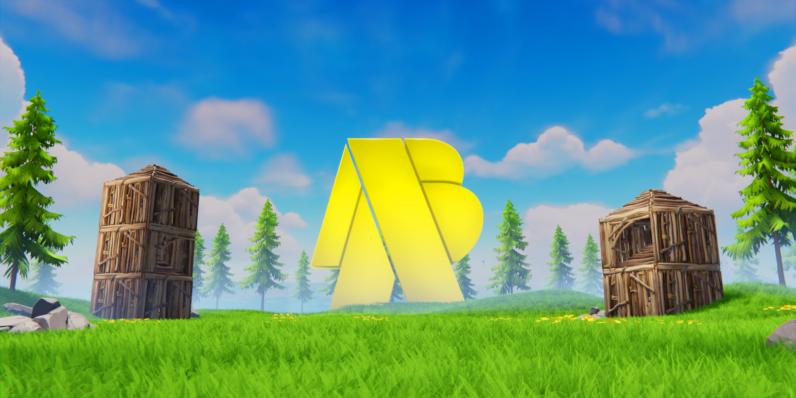</td>
</tr>
</table>

## Systems

### Modes (Versions/Configurations)

[`rr_config`](config/rr_config.verse)

One of the biggest blockers in UEFN was offering different modes for the same "game." The simplest example is team modes. In Fortnite, there is solo, duo, trio, and squad team sizes for Battle Royale. To choose which one you wanted to play you would select the game then select the team size. However, as a UGC creator we didn't have access to that. All games were published with unique 12 digit codes, and all we could do was restrict the number of players to queue. We couldn't even automatically queue players into specific servers/experiences. All that would typically be done by a "matchmaker" had to be handled within the game itself. 

This limitation was especially frustrating because there was no "branching" or project system to accomdate for this. There was two common approaches to this problem: 
1. Offering both gamemodes in the same "game" and allowing each lobby to pick.
    > The issue with this approach, is how do you do it? Early bird gets the worm? Majority vote? No matter what somebody loses by not playing what they set out to play.
2. Duplicating the project and altering it.
    > Now your version control is no longer as simple as it should be. Now updates to the level (or generally just things too large to store in a standard Git repo) have to be done in both projects. You are also splitting the playerbase across two projects instead of just one, which means both have to fight for their positions in the discover algorithm seperately...This is still the case as of mid 2026. Not a fan!

This didn't seem ideal, so I wrapped the game logic to be dependent on a singular [`rr_config`](config/rr_config.verse) definition that could be referenced by the main game object (device). This allowed me to have one branch that I could pull/push to. Even for the Unreal levels we used the same level for the landscape (meaning we didn't have to constantly migrate back and forth), and then used an instanced level for the gamemode specific references (devices and the like). I still think this approach was ahead of its time, and as of mid 2026 I don't think other groups have an approach as streamlined as this.

---

### Respawning (Rebooting)

[`rr_rebooter`](src/rr_rebooter.verse)
[`rr_reboot_bank`](src/rebooting/rr_reboot_bank.verse)

Repawning was rather tricky. Fortnite/UEFN/Verse already has a lot of jank in terms of when a player is "eliminated" and when they can come back. Essentially I generalized the reboot mechanics

---

### Teams

[`rr_team_selectable`](src/teams/rr_team_selectable.verse)
[`rr_team_selector`](src/teams/rr_team_selector.verse)

Very simple stuff. Wrapped `fort_team_collection` into a manager object which takes care of a lot of boilerplate. Essentially controls team sizes and neutral team placement. Also does auto team selection when time runs out.

A lot of people got misguided around the time this game came out to replace their interactive 3D space team selection with UI menus. The issue with this is its just not as fun or expressive. So we kept the standard "stand in the circle if you want to be on this team" but with a little more... you have to **stay** in the circle to be on the team. This requires players to stand their ground. Why would they need to do that? Well Fortnite has slide kicking which means you can slide and push people out of the way. This doubles as a troll and an actual useful mechanic! Say you are partied with your friend but a random took your place as teammate. No worries! Just slide into the random and he will get kicked out of the circle.

---

### States

[`rr_state`](src/state/rr_state.verse)

I used a state machine pattern to manage transition between states. This is done using my FN_Gameplay package, which isn't visible quite yet, but you can see a lot of it in [`src/state/...`](src/state/)

---

### Join-in-progress

[`rr_participant_manager`](src/rr_participant_manager.verse)

I just wanted to put this here to say Join-in-progress is a pain. As of now (mid 2026) I cannot set a games join behavior to `Spectate Immediately` because respawning the player via Verse will prevent the player from properly interacting with world elements. Instead, you have to allow the player to join and spawn in the world, and then as soon as their avatar (`fort_character`) is loaded *constantly* try to eliminate them so they can spectate. Due to this complication, you really have to make sure that the actual game logic is only looking at the players "registered" for the current game and not those that are just joining. 

---

### Analytics and XP

[`rr_analyzer_awarder`](src/rr_analyzer_awarder.verse)

Simple. Just made global singletons that when given an enumeration value would award XP or register analytic events. Didn't need to overengineer this. This was useful in knowing what loadouts were the least popular and when certain states were triggered.

--- 

### Rounds

[`rr_round_manager`](src/rr_round_manager.verse)

Round manager made it really simple to have repeated gameplay not be associated with the team selection, the join in progress, or anything else.

---

### Scoring

[`rr_scoring_controller`](src/scoring/rr_scoring_controller.verse)

Scoring was unique because its a round based gamemode where players are able to change their team every round. For that reason, scoring had to be both independent to the individual contributors and grouped by team. The approach I took was just ranking each team by the score of the maximum of each members score.

---

## UI and HUD

---

### Team Scoring

[`rr_scoring_model`](src/scoring/rr_scoring_model.verse)
[`rr_scoring_view`](src/scoring/rr_scoring_view.verse)

Scoring HUD was managed with a model-view-controller adjacent approach. Its not perfect and probably not really necessary.

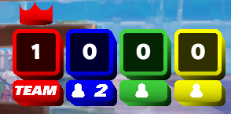

Here you can see a scoreboard HUD that is ordered by score left-to-righ (with the first place getting a crown) denoting the number of players the team has alive as well as the team the viewer belongs to.

#### Assets V2

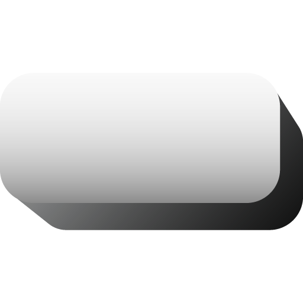

Here are the assets I used for the team scoring created in Adobe Illustrator. They are stacked on top of each other with a stack box and then multiplied by a team tint.

#### Assets V1

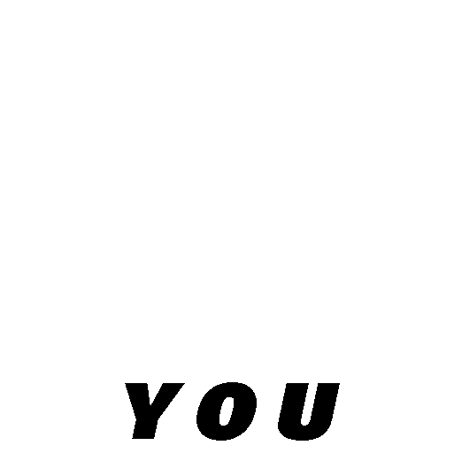

---

### Item Selection

I designed these holographic buttons inspired by the already holographic/techy look that Epic Games' original mode was giving. I am really proud of this UI even though it was extremely limited. I think this still looks good given the time as it matched the moment that overall Fortnite Reload game was in.

---

### Notifications

Notifications I made mirroring the style of the Reload HUD elements. Nothing was imported. These were all recreated in UMG and material graph.

#### Reboots disabled

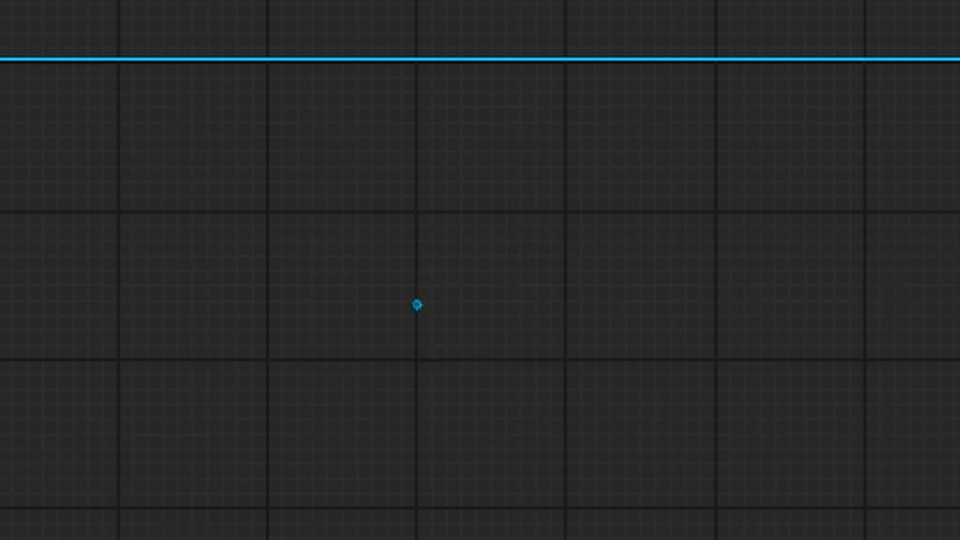

#### Infinite reboots

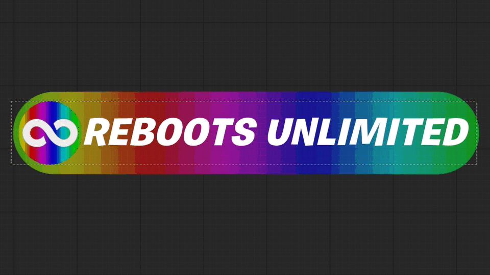

#### Infinite-to-limited reboots

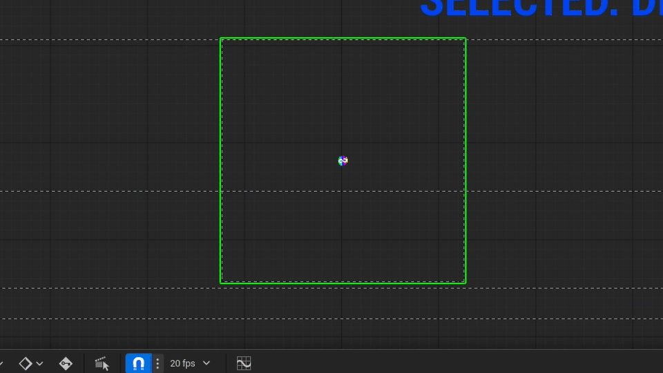

---

## Logos

Short logo. Two capital "R" overlapped on top of each other.

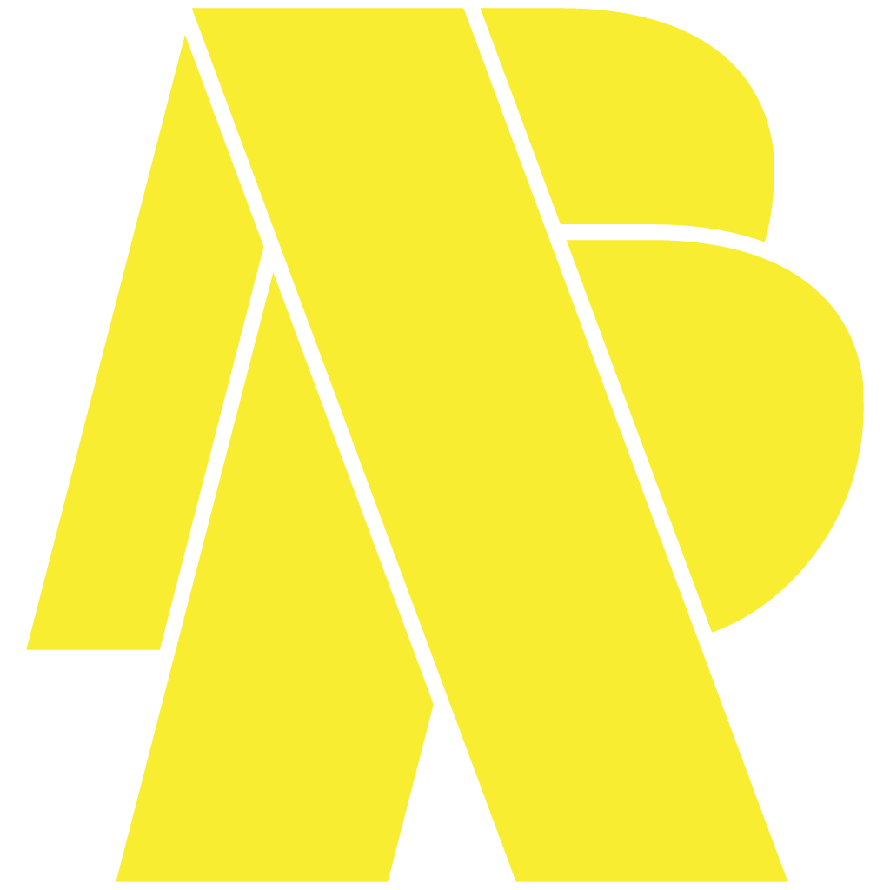

Full logo. Lower-case "reload" on top of "Realistics" connected by an arrow.

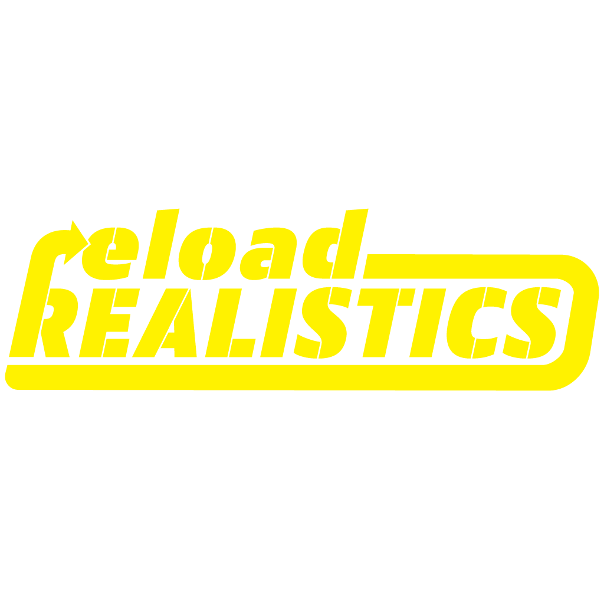